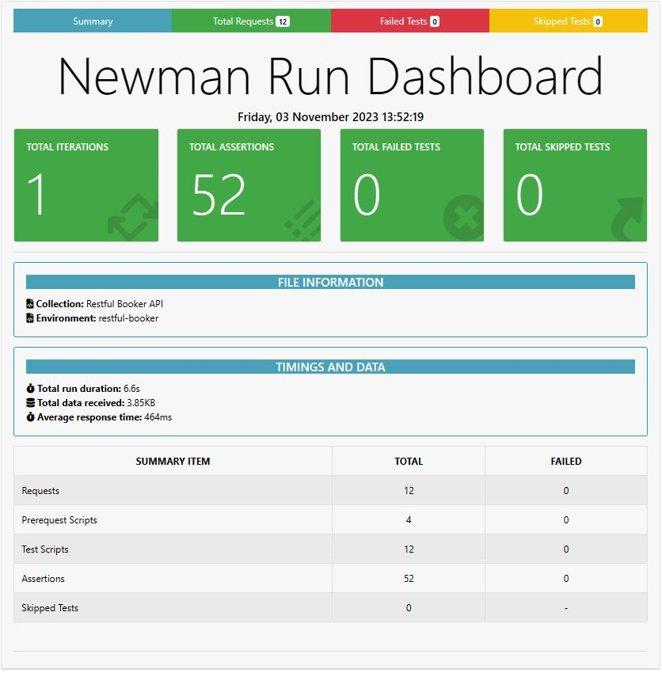

# Content    
- [ Discription](#discription )
- [Summary](#summary) 
- [Newman Report](#newmanreport) 
# Discription 
I have completed API testing on a booking website. The following website is the website I have tested. https://restful-booker.herokuapp.com/

Tasks Done

-CRUD operations such as Create, Get, Put & Patch, and Delete.

-Writing pre-request scripts using dynamic parameters

-API Request & Response Chaining

-Writing test scripts for data validation.

-Newman HTML & HTML Extra Report

# Summary 
The summary of all the tasks done for the restful-booker websites is given below with a table.

# Newman Report
The Report of all the tasks done for the restful-booker websites is given below with a table.

