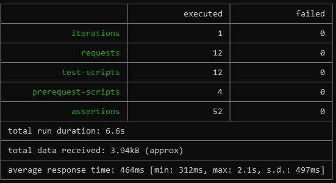

# Content    
- [ Description](#discription )
- [Summary](#summary) 
- [Newman Report](#newmanreport) 
# Description 
I have completed API testing on a booking website. The following website is the website I have tested. https://restful-booker.herokuapp.com/

Tasks Done

-CRUD operations such as Create, Get, Put & Patch, and Delete.

-Writing pre-request scripts using dynamic parameters

-API Request & Response Chaining

-Writing test scripts for data validation.

-Newman HTML & HTML Extra Report

# Summary 
The summary of all the tasks done for the restful-booker websites is given below with a table.


# Newman Report
The Report of all the tasks done for the restful-booker websites is given below with a table.


## Prerequisites

Before running the tests and generating HTML reports, ensure you have the following prerequisites installed on your system:

- [Postman](https://www.postman.com/downloads/): Install Postman to create and export your collection and environment files.
- [Newman](https://learning.postman.com/docs/running-collections/using-newman-cli/installation-postman-pm/): Install Newman to run Postman collections from the command line.
- [Node.js](https://nodejs.org/): Ensure you have Node.js installed, as Newman requires it.

## Instructions

Follow these steps to run your API tests and generate HTML reports using Newman and the provided collection and environment files:
1. **Clone the Repository**:
   - Clone this Git repository to your local machine using the following command:
     ```bash
     git clone https://github.com/ShamimaSultanaMiley/API-Testing-Project-1.git
     ```


